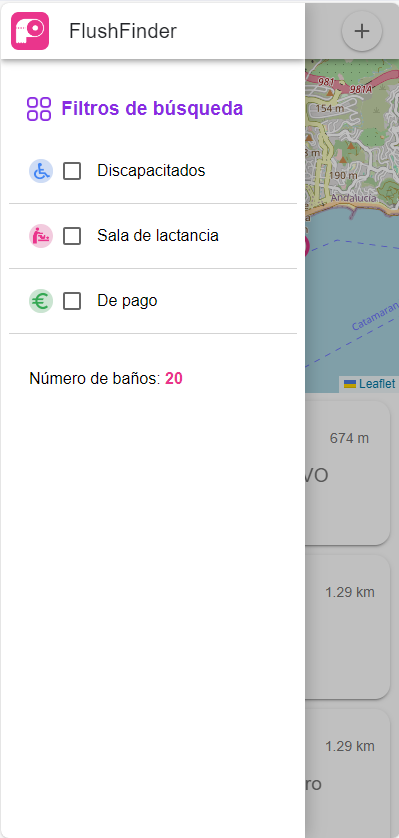
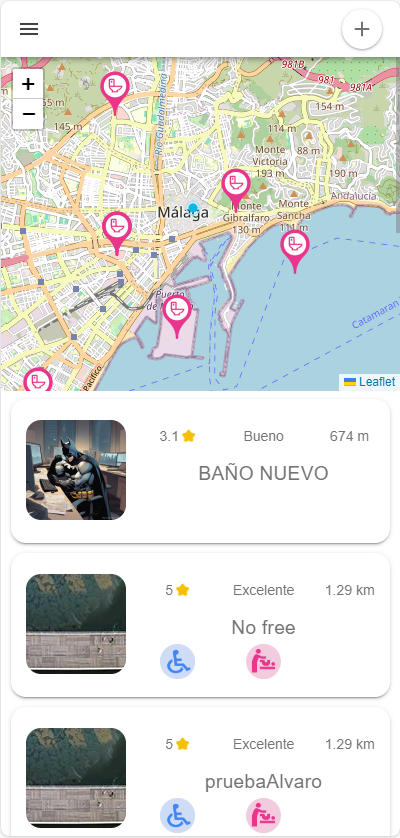
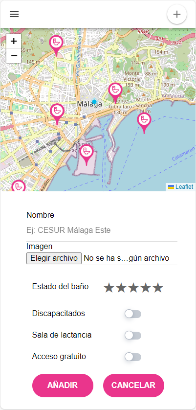

# Flushfinder 
La aplicación se trata, básicamente de un mapa interactivo que permita al usuario encontrar los baños públicos cercanos con respecto a su ubicación actual.<br/>
El público objetivo son personas con necesidades especiales a la hora de buscar un baño, por ello se dispone de unos filtros para personas discapacitadas, que los baños tengan sala de lactancia o que los aseos sean de pago.

### Imágenes de la aplicación

<div align="center">
      
</div>


## Acceso a la aplicación
La aplicación tiene dos versiones: una versión web que funciona en cualquier navegador, y una versión movil que solamente funciona en dispositivos Android. Si tienes un dispositivo IOS recomendamos usar la web.<br/>
[Enlace para la versión web](http:flushfinder.es) <br/>
[Enlace para la APK Android](https://drive.google.com/file/d/1MiTsMvBIVW7MBn7LvNZbajjgm47_dys9/view?usp=sharing)

## Instalación
Una vez descargado el APK, hay que instalarlo. Para ello nos vamos al apartado “Mis Archivos” o en su defecto, el lugar en el que se encuentran los archivos de tu dispositivo móvil.  <br/>
Una vez dentro, nos vamos al apartado “APK” y buscamos el archivo “app-debug.apk”. Pulsamos sobre él e instalamos. La primera vez que se ejecuta la APK, se debe conceder el permiso de conocer tu ubicación mientras
se utiliza la aplicación, posteriormente pedirá acceso a la ubicación precisa.

### Comandos utilizados

1. **Visualización de la aplicación web:**
    ```
    npm run dev
    ```
    Este comando se utiliza para visualizar la aplicación en la web.


2. **Ejecución en Android Studio:**
    ```
    ionic capacitor build android
    ```
    Este comando compila la aplicación y la ejecuta en Android Studio.


3. **Geolocalización:**
    ```
    npm install cordova-plugin-geolocation @ionic-native/geolocation
    ```
    Este comando descarga el plugin necesario para la geolocalización.


4. **Mapa:**
    ```
    npm install leaflet
    npm install --save-dev @types/leaflet
    ionic generate component Mapa
    ```
    Estos comandos descargan el plugin Leaflet y crean el componente Mapa.


5. **Sincronización de plugins:**
    ```
    npx cap sync
    ```
    Este comando se ejecuta antes de transpilar a Android para sincronizar los plugins de Capacitor con la build de Android.


6. **Palabras malsonantes:**
    ```
    npm install bad-words
    npm i --save-dev @types/bad-words
    ```
    Estos comandos instalan el diccionario de palabras malsonantes.


7. **Notificaciones tipo toast:**
    ```
    npm install vue-toast-notification --save
    npm install vue-toast-notification@^3
    ```
    Estos comandos instalan la librería de notificaciones tipo toast para Vue.


### Recursos Utilizados

- **APIs:**
    - Geolocation API
    - Google Maps Distance Matrix API.

- **Mapa personalizado:**
    - Leaflet.js

- **Servicio de hosting online**

- **Instalación de servidor de Ubuntu y MongoDB:**
    - Ejecución mediante Node.js
    - Se utliza Compass para acceder a MongoDB

- **Adquisición del dominio para la versión web**
  
- **Acceso remoto al servidor:**
  - Se utiliza PuTTY "api.flushfinder.es"

### Gestión de Frontend
1. **Acceso al dominio "server.flushfinder.es"**
2. **Se transpila el proyecto con Express**
3. **Se sube**
4. **A traves del index se ejecuta todo el proyecto**

